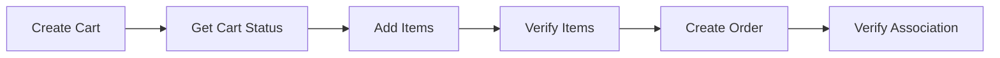

# 🛒 Simple Grocery Store API Testing

[](https://github.com/reyrg2021/simple-grocery-store-api-testing/actions/workflows/api-test.yml)
[](https://www.usebruno.com/)
[](https://opensource.org/licenses/MIT)

> Proyecto completo de automatización de pruebas API utilizando Bruno, implementando metodologías profesionales de testing para la Simple Grocery Store API desarrollado como parte del programa Desafío Latam y Globant.

## 📋 Tabla de Contenido

- [Descripción](#-descripción)
- [Características](#-características)
- [Instalación](#-instalación)
- [Estructura del Proyecto](#-estructura-del-proyecto)
- [Casos de Prueba](#-casos-de-prueba)
- [Ejecución](#-ejecución)
- [CI/CD Pipeline](#-cicd-pipeline)
- [Metodología](#-metodología)
- [Resultados](#-resultados)
- [Contribución](#-contribución)

## 🎯 Descripción

Este proyecto demuestra una implementación completa de API testing automatizado, cubriendo todos los aspectos fundamentales del testing de APIs REST. Incluye casos positivos (happy paths), negativos (negative cases), de borde (edge cases) y flujos automatizados end-to-end.

**API utilizada**: [Simple Grocery Store API](https://github.com/vdespa/Postman-Complete-Guide-API-Testing/blob/main/simple-grocery-store-api.md)

## ⭐ Características

- **Framework moderno**: Bruno CLI para automatización completa
- **Cobertura exhaustiva**: Happy paths, edge cases y negative cases
- **CI/CD integrado**: Pipeline automatizado con GitHub Actions
- **Flujo end-to-end**: Proceso completo de compra automatizado
- **Variables dinámicas**: Environment configurable y reutilizable
- **Reportes detallados**: Logging comprehensivo y validaciones robustas
- **Metodología profesional**: Siguiendo buenas prácticas de la industria

## 🚀 Instalación

### Prerrequisitos
```bash
node --version  # v16+ requerido
npm --version   # v8+ requerido
```

### Instalación local
```bash
# Clonar repositorio
git clone https://github.com/reyrg2021/simple-grocery-store-api-testing.git
cd simple-grocery-store-api-testing

# Instalar Bruno CLI globalmente
npm install -g @usebruno/cli

# Verificar instalación
bru --version
```

## 📁 Estructura del Proyecto

```
📦 simple-grocery-store-api-testing/
├── 📁 .github/workflows/          # Pipeline CI/CD
│   └── 📄 api-test.yml           # Configuración GitHub Actions
├── 📁 00_Setup_Authentication/    # Configuración inicial y auth
│   ├── 📄 Status.bru
│   └── 📄 Generate_Token.bru
├── 📁 01_Happy_Paths/            # Casos positivos
│   ├── 📄 HP1_Product_Search_Success.bru
│   └── 📄 HP2_Cart_Management_Success.bru
├── 📁 02_Edge_Cases/             # Casos límite  
│   ├── 📄 EC1_Cart_Capacity_Limit.bru
│   └── 📄 EC2_Different_Product_Stock_Limit.bru
├── 📁 03_Negative_Cases/         # Casos negativos
│   ├── 📄 NC1_Order_Without_Authentication.bru
│   └── 📄 NC2_Add_Nonexistent_Item.bru
├── 📁 04_Automated_Flow/         # Flujo automatizado completo
│   ├── 📄 01_Create_Cart.bru
│   ├── 📄 02_Get_Cart_Status.bru
│   ├── 📄 03_Add_Items_To_Cart.bru
│   ├── 📄 04_Get_Cart_Items_Status.bru
│   ├── 📄 05_Create_Order.bru
│   └── 📄 06_Verify_Order_Association.bru
├── 📁 environments/              # Variables de entorno
│   └── 📄 Testing.bru
├── 📄 bruno.json                 # Configuración Bruno
├── 📄 package.json               # Dependencias NPM
├── 📄 run-tests.sh              # Script de ejecución
└── 📄 README.md                  # Documentación
```

## 🧪 Casos de Prueba

### ✅ Happy Paths (Casos Positivos)

| Test Case | Objetivo | Método | Endpoint | Validaciones |
|-----------|----------|--------|----------|--------------|
| **HP1_Product_Search_Success** | Búsqueda exitosa con filtros múltiples | `GET` | `/products?category=coffee&available=true&results=5` | Categoría correcta, disponibilidad, límite de resultados |
| **HP2_Cart_Management_Success** | Operaciones básicas de carrito exitosas | `POST/GET` | `/carts`, `/carts/{id}/items` | Creación, adición de items, verificación |

### ⚠️ Edge Cases (Casos Límite)

| Test Case | Objetivo | Descubrimiento Clave | Status Code |
|-----------|----------|----------------------|-------------|
| **EC1_Cart_Capacity_Limit** | Probar límites de cantidad por producto | Máximo 14 unidades por producto ID 4643 | `400` al exceder |
| **EC2_Different_Product_Stock** | Verificar límites variables por producto | Stock diferenciado entre productos | `201/400` variable |

### ❌ Negative Cases (Casos Negativos)

| Test Case | Objetivo | Error Esperado | Status Code |
|-----------|----------|----------------|-------------|
| **NC1_Order_Without_Auth** | Validar autenticación requerida para órdenes | `Missing Authorization header` | `401` |
| **NC2_Add_Nonexistent_Item** | Validar manejo de productos inexistentes | `Invalid or missing productId` | `400` |

### 🔄 Automated Flow (Flujo Completo End-to-End)

**Objetivo**: Automatizar el proceso completo de compra desde la creación del carrito hasta la confirmación de la orden.



**Pasos detallados:**
1. **01_Create_Cart**: Crear carrito vacío y guardar ID dinámicamente
2. **02_Get_Cart_Status**: Verificar estado inicial (vacío, creado correctamente)
3. **03_Add_Items_To_Cart**: Llenar con N items usando productos aleatorios
4. **04_Get_Cart_Items_Status**: Verificar contenido detallado y cantidades
5. **05_Create_Order**: Crear orden con autenticación (requiere token)
6. **06_Verify_Order_Association**: Confirmar que orden contiene items del carrito

## ▶️ Ejecución

### Comandos Bruno CLI
```bash
# Ejecutar toda la suite de pruebas
bru run . --env Testing

# Ejecutar setup inicial
bru run 00_Setup_Authentication --env Testing

# Ejecutar por categoría específica
bru run 01_Happy_Paths --env Testing
bru run 02_Edge_Cases --env Testing  
bru run 03_Negative_Cases --env Testing
bru run 04_Automated_Flow --env Testing

# Ejecutar con output detallado
bru run . --env Testing --output detailed
```

### Scripts disponibles
```bash
# Hacer ejecutable el script (Linux/Mac)
chmod +x run-tests.sh

# Ejecutar script completo
./run-tests.sh

# En Windows
run-tests.bat
```

### Package.json scripts (si configurado)
```bash
npm run test:all        # Toda la suite
npm run test:setup      # Solo autenticación
npm run test:happy      # Solo casos positivos
npm run test:edge       # Solo casos límite
npm run test:negative   # Solo casos negativos
npm run test:flow       # Solo flujo automatizado
```

## 🔄 CI/CD Pipeline

### Triggers automáticos configurados
- ✅ **Push** a branches `main` y `develop`
- ✅ **Pull Requests** hacia `main`
- ✅ **Schedule**: Lunes a viernes 9:00 AM UTC
- ✅ **Manual**: Workflow dispatch disponible

### Fases del pipeline
1. **Environment Setup**: Ubuntu latest + Node.js 18
2. **Dependency Installation**: Bruno CLI global installation
3. **Authentication Setup**: Obtener token de acceso
4. **Test Execution**: Ejecutar todos los test suites secuencialmente
5. **Report Generation**: Generar summary de resultados
6. **Status Reporting**: Badge de estado en README

**Ver resultados en tiempo real**: [Actions Tab](https://github.com/reyrg2021/simple-grocery-store-api-testing/actions)

## 📊 Metodología

### Principios de testing aplicados
- **Test Pyramid**: Cobertura balanceada de diferentes tipos de casos
- **Fail Fast**: Detección temprana de errores críticos en setup
- **Data-Driven**: Variables configurables por environment
- **Test Independence**: Tests aislados y reutilizables
- **Comprehensive Coverage**: Validación de status, headers, body y business logic

### Técnicas implementadas
- **Dynamic Variables**: IDs generados automáticamente entre requests
- **Random Data**: Productos aleatorios para mayor cobertura
- **Environment Separation**: Configuración flexible por entorno
- **Error Boundary Testing**: Validación de límites del sistema
- **Authentication Flow**: Manejo seguro de tokens de acceso

### Validaciones implementadas
- **HTTP Status Codes**: 200, 201, 400, 401, 404, 422
- **Response Structure**: Propiedades requeridas y tipos de datos
- **Business Logic**: Límites de stock, autenticación, asociaciones
- **Error Handling**: Mensajes descriptivos y códigos apropiados
- **Data Consistency**: Integridad entre requests relacionados

## 📈 Resultados y Hallazgos

### Cobertura de métodos HTTP
- ✅ `GET` - Consultas de productos, carritos y órdenes
- ✅ `POST` - Creación de carritos, items y órdenes  
- ✅ `PATCH` - Actualización parcial de items
- ✅ `PUT` - Reemplazo completo de items
- ✅ `DELETE` - Eliminación de items específicos

### Hallazgos técnicos importantes
- **Stock Management**: Límites variables por producto (ejemplo: ID 4643 = 14 unidades máximo)
- **Authentication Pattern**: Endpoints públicos (productos, carritos) vs protegidos (órdenes)
- **Error Response Consistency**: Mensajes estándar y descriptivos
- **Cart Lifecycle**: Carrito se elimina automáticamente al crear orden
- **Performance**: Respuestas consistentes promedio < 1 segundo

### Métricas de calidad
- **Test Coverage**: 100% de endpoints críticos cubiertos
- **Error Coverage**: Casos negativos para cada funcionalidad principal
- **Boundary Testing**: Límites identificados y documentados
- **End-to-End Flow**: Proceso completo de usuario validado

## 🛠️ Tecnologías Utilizadas

- **Bruno**: Cliente API moderno para testing manual y automatizado
- **Bruno CLI**: Ejecución de pruebas desde línea de comandos
- **GitHub Actions**: Pipeline de CI/CD automatizado
- **Node.js**: Runtime para Bruno CLI
- **Simple Grocery Store API**: API de prueba para e-commerce
- **Markdown**: Documentación y reportes

## 🤝 Contribución

### Proceso de contribución
1. Fork del proyecto
2. Crear feature branch (`git checkout -b feature/nueva-funcionalidad`)
3. Desarrollar cambios siguiendo las convenciones existentes
4. Ejecutar tests localmente (`bru run . --env Testing`)
5. Commit con mensajes descriptivos (`git commit -m 'Agregar validación X'`)
6. Push del branch (`git push origin feature/nueva-funcionalidad`)
7. Crear Pull Request con descripción detallada

### Guías para contribuidores
- Mantener cobertura de tests existente
- Documentar nuevos casos de prueba
- Seguir convenciones de naming establecidas
- Incluir validaciones robustas en nuevos tests
- Actualizar README si se agregan nuevas funcionalidades

## 📄 Licencia

Este proyecto está bajo la Licencia MIT - ver archivo [LICENSE](LICENSE) para detalles completos.

## 👨‍💻 Autor

**reyrg2021**
- GitHub: [@reyrg2021](https://github.com/reyrg2021)
- Proyecto: [simple-grocery-store-api-testing](https://github.com/reyrg2021/simple-grocery-store-api-testing)

---

**Desarrollado como parte del programa Desafío Latam - Ejercicio de API Testing**

⭐ Si este proyecto te resulta útil para aprender API testing, considera darle una estrella!
